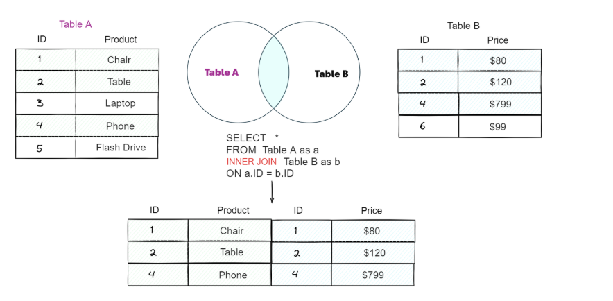
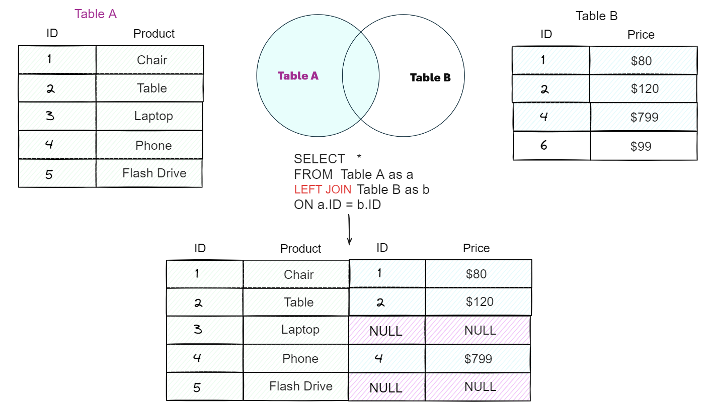
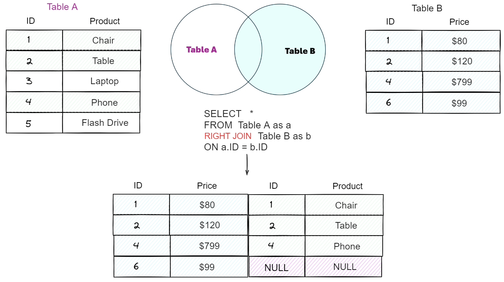
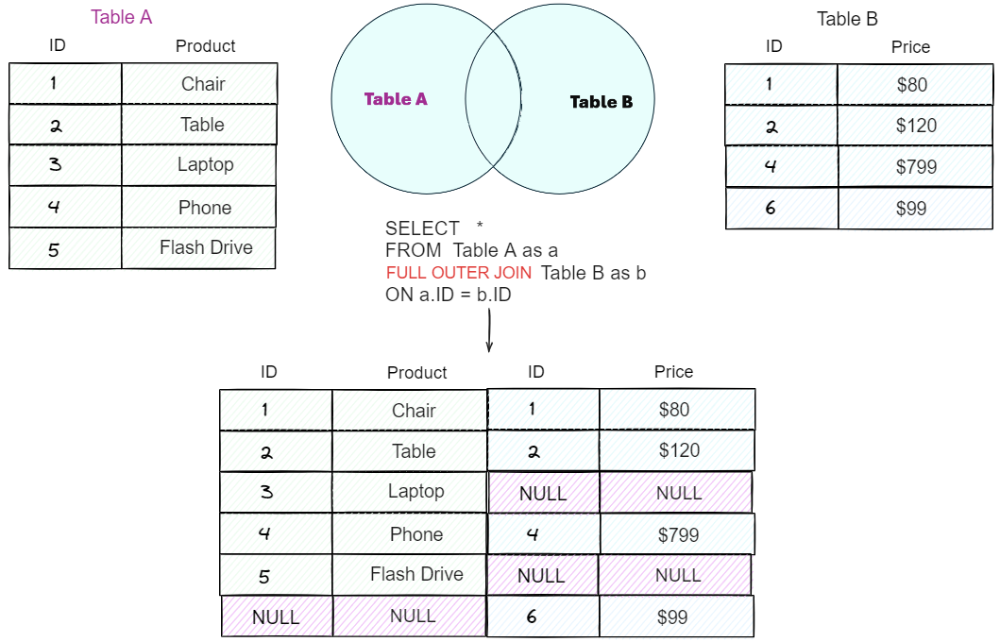

## what is sql

SQL (Structured Query Language) হলো একটি বিশেষ প্রোগ্রামিং ভাষা যা ডাটাবেসের সাথে কথা বলার জন্য ব্যবহার করা হয়।
এটি ব্যবহার করে তুমি ডাটাবেসে ডাটা সংরক্ষণ, খোঁজা, আপডেট করা, মুছা—সবকিছুই করতে পারো।
the language we use to comminicute with databases.
it discovered by IBM in the early 1970s.

🔹 SQL কেন ব্যবহার করা হয়?

SQL ব্যবহার করা হয়—

ডাটাবেস থেকে ডাটা বের করতে

ডাটাবেসে নতুন ডাটা ঢুকাতে

ডাটা আপডেট করতে

ডাটা ডিলেট করতে

নতুন টেবিল বা ডাটাবেস তৈরি করতে

টেবিলের স্ট্রাকচার পরিবর্তন করতে

🔹 SQL কে ব্যবহার করে?

যে কোনো ডাটাবেস সিস্টেম যা RDBMS (Relational Database Management System) — যেমন

MySQL

PostgreSQL

Oracle

SQL Server

এসব সবই SQL ব্যবহার করে।

🔹 SQL এর প্রধান কমান্ড ৩ ভাগে ভাগ করা হয়:
1️⃣ DDL (Data Definition Language)

→ ডাটাবেস বা টেবিলের স্ট্রাকচার ব্যবস্থাপনা করার জন্য
উদাহরণ:

CREATE

ALTER

DROP

TRUNCATE

2️⃣ DML (Data Manipulation Language)

→ ডাটার ওপর কাজ করার জন্য

INSERT

UPDATE

DELETE

3️⃣ DQL (Data Query Language)

→ ডাটা খোঁজার জন্য

SELECT

3️⃣ DQL (Data Query Language)

🔹 SQL কেন গুরুত্বপূর্ণ?

ডাটাবেসে কাজ করতে হলে SQL অবশ্যই জানতে হবে

ওয়েব ডেভেলপার, সফটওয়্যার ইঞ্জিনিয়ার, ডাটা অ্যানালিস্ট—সবার জন্য প্রয়োজন

সব বড় কোম্পানিতে SQL ব্যবহৃত হয়

ইন্টারভিউতেই SQL প্রশ্ন প্রায়ই আসে

## ⭐ SQL কেন Declarative?

SQL Declarative কারণ তুমি শুধু বলো ডাটা কেমন চাই
কিন্তু কিভাবে খুঁজে আনবে সেটা SQL Engine নিজে ঠিক করে।

## why need data type in sql

ডাটা টাইপ কেন দরকার? (Bangla তে পরিষ্কার ব্যাখ্যা)

ডাটাবেস, প্রোগ্রামিং—সব জায়গায় Data Type খুব গুরুত্বপূর্ণ কারণ এটি বলে দেয় ডাটার ধরন, কীভাবে সংরক্ষণ হবে, এবং কীভাবে আচরণ করবে।

✅ 2. মেমরি ঠিকমত বরাদ্দ করতে

PostgreSQL বা অন্য ডাটাবেস ডাটা টাইপ দেখে ঠিক করে কত জায়গা মেমরি বা স্টোরেজ লাগবে।

উদাহরণ:

SMALLINT → 2 bytes

INTEGER → 4 bytes

BIGINT → 8 bytes

এই কারণে স্টোরেজ efficient হয়।

✅ 3. ভুল ডাটা ঢুকতে দেয় না (Data Validation)

ডাটা টাইপ ভুল ডাটা আটকায়।

উদাহরণ:
age INT করলে

তুমি নাম লিখতে পারবে না

"abc" ঢুকবে না

কেবল সংখ্যা ঢুকবে

ডাটা সঠিক থাকে → Data Integrity বজায় থাকে।

✅ 4. সঠিকভাবে অপারেশন করতে সাহায্য করে

যদি ডাটা টাইপ ভুল দাও, অপারেশন কাজ করবে না।

উদাহরণ:
10 + 20 কাজ করবে (Number type)
"10" + "20" → String হলে concatenate হবে
DATE1 - DATE2 → শুধু date টাইপে কাজ করে

ডাটা টাইপ ঠিক থাকলে অপারেশন সঠিক ভাবে কাজ করে।

✅ 5. Query Performance বাড়ায়

সঠিক ডাটা টাইপ দিলে:

Index ভালো কাজ করে

Search দ্রুত হয়

Sorting/Filtering দ্রুত হয়

Query performance improve হয়

✅ 6. স্টোরেজ সাশ্রয়

ছোট টাইপ ব্যবহার করলে স্টোরেজ কম লাগে।

উদাহরণ:
age = 0 থেকে 120 → SMALLINT যথেষ্ট
কিন্তু তুমি যদি BIGINT দাও → স্টোরেজ নষ্ট

## database , table create and delete command in sql

```sql

-- create database
create database school

  -- create tabgle

create table students(
  id serial ,
  name varchar(50),
  age int,
  isActive boolean,
  dob date


);

-- delete table
drop table students

-- good way for delete
drop table if exists students
```

### database constraints

Database constraints are rules that the database uses to protect data accuracy, validity, and consistency.

👉 সহজ কথায়:
Constraint = database-এর security guard 🚨
যে ভুল data ঢুকতে দেয় না।

🔑 Why do we need database constraints?

Without constraints:

Duplicate data ঢুকতে পারে

Invalid values store হতে পারে

Relationship ভেঙে যেতে পারে (foreign key problem)

With constraints:
✔️ Data correct থাকে
✔️ Data consistent থাকে
✔️ Database reliable হয়

📌 Types of Database Constraints (Most Important)
1️⃣ NOT NULL

❌ NULL value allow করে না

```sql
name VARCHAR(50) NOT NULL
```

2️⃣ UNIQUE

❌ Duplicate value allow করে না

```sql
email VARCHAR(100) UNIQUE
➡️ একই email দুইবার ঢুকবে না
```

3️⃣ PRIMARY KEY

✔️ Row uniquely identify করে
✔️ NOT NULL + UNIQUE দুটোই

```sql
id SERIAL PRIMARY KEY
```

4️⃣ FOREIGN KEY

✔️ Table-to-table relationship maintain করে

```sql
course_id INT,
FOREIGN KEY (course_id) REFERENCES courses(id)
```

5️⃣ CHECK

✔️ Condition enforce করে

```sql
age INT CHECK (age >= 0)
➡️ 0 এর কম age ঢুকবে না
```

6️⃣ DEFAULT

✔️ Value না দিলে default বসে

```sql
isActive BOOLEAN DEFAULT TRUE
➡️ value না দিলে TRUE হবে
```

```sql
CREATE TABLE users (
    id SERIAL PRIMARY KEY,
    name VARCHAR(50) NOT NULL,
    email VARCHAR(100) UNIQUE,
    age INT CHECK (age >= 18),
    created_at TIMESTAMP DEFAULT CURRENT_TIMESTAMP
);
```

## insert in database

there are several common way to insert data into a database i am showing it below :

✅ 1️⃣ INSERT with column names (Most common & recommended)

```sql
INSERT INTO students (name, age, isActive, dob)
VALUES ('Alice', 20, TRUE, '2003-05-15');

✔️ Safe
✔️ Readable
✔️ Order doesn’t matter
```

✅ 2️⃣ INSERT without column names (Not recommended)

```sql
INSERT INTO students
VALUES (1, 'Bob', 22, FALSE, '2001-08-20');
❌ Column order must match table
❌ Breaks if schema changes
```

✅ 3️⃣ INSERT multiple rows

```sql
INSERT INTO students (name, age, isActive, dob)
VALUES
  ('Charlie', 19, TRUE, '2004-02-10'),
  ('Diana', 21, FALSE, '2002-11-25'),
  ('Ethan', 23, TRUE, '2000-07-30');

✔️ Faster
✔️ Used in bulk insert
```

✅ 4️⃣ INSERT with SELECT (Insert from another table)

```sql
INSERT INTO alumni (name, age, isActive, dob)
SELECT name, age, isActive, dob from students
✔️ Data migration
✔️ Backup purpose
```

✅ 5️⃣ INSERT with DEFAULT values

```sql
INSERT INTO students (name, age)
VALUES ('Fiona', 18);
```

✅ 6️⃣ INSERT with RETURNING (PostgreSQL only)

```sql
INSERT INTO users (name, email)
VALUES ('Asad', 'asad@gmail.com')
RETURNING id;
✔️ Instantly get inserted ID
✔️ Very useful in backend
```

✅ 7️⃣ INSERT with ON CONFLICT / IGNORE (Avoid duplicate error)

```sql
INSERT INTO users (email, name)
VALUES ('adfsdsdf')
ON CONFLICT (email) DO NOTHING;
```

slide link:
https://drive.google.com/file/d/1zPLUb2mSC4w2cT7YIV8jGYi5RWK__-q-/view

## Alter keyword

🔧 ALTER কী? (SQL / PostgreSQL)

ALTER হলো একটি SQL keyword যা ব্যবহার করা হয়
👉 আগে থেকে তৈরি করা টেবিল, কলাম বা ডাটাবেসের structure (গঠন) পরিবর্তন করার জন্য।

সহজ ভাষায়:
👉 টেবিল বানানোর পর যদি কিছু বদলাতে চাও, তখন ALTER ব্যবহার করা হয়।

🔹 কেন ALTER দরকার?

বাস্তবে ডাটাবেস বানানোর পর অনেক সময়—

নতুন কলাম যোগ করতে হয়

কোনো কলাম মুছতে হয়

কলামের ডাটা টাইপ বদলাতে হয়

কলামের নাম পরিবর্তন করতে হয়

constraint (NOT NULL, UNIQUE ইত্যাদি) যোগ/মুছতে হয়

এই কাজগুলো করার জন্যই ALTER দরকার।

## select

🔍 SELECT কী? (SQL)

SELECT হলো SQL-এর সবচেয়ে গুরুত্বপূর্ণ keyword।
এটি ব্যবহার করা হয় 👉 ডাটাবেস থেকে ডাটা বের (read) করার জন্য।

for retrieve data from database,can be customized with various clauses like WHERE, ORDER BY, GROUP BY etc.

সহজ কথায়:
👉 ডাটাবেসকে বলা—“এই ডাটাগুলো আমাকে দেখাও।”

🔹 SELECT কেন ব্যবহার করা হয়?

SELECT দিয়ে তুমি করতে পারো—

টেবিলের সব ডাটা দেখতে

নির্দিষ্ট কলামের ডাটা দেখতে

শর্ত অনুযায়ী ডাটা বের করতে

ডাটা sort করতে

ডাটা filter করতে

aggregate হিসাব (count, sum, avg) করতে

🔹 FROM

👉 কোন টেবিল থেকে ডাটা নেওয়া হবে

🔹 WHERE

👉 শর্ত দিয়ে ডাটা filter করার জন্য (row level)

🔹 GROUP BY

👉 একই ধরনের ডাটাকে group করার জন্য

🔹 HAVING

👉 group করা ডাটার উপর শর্ত দেওয়ার জন্য

🔹 JOIN

👉 একাধিক টেবিল একসাথে যুক্ত করে ডাটা দেখার জন্য

🔹 ORDER BY

👉 ডাটা সাজানোর জন্য (ASC / DESC)

🔹 DISTINCT

👉 duplicate ডাটা বাদ দেওয়ার জন্য

🔹 LIMIT

👉 কয়টা row দেখাবে তা নির্ধারণ করে

🔹 OFFSET

👉 কতগুলো row বাদ দিয়ে তারপর দেখাবে

trix of excution order:

FROM → JOIN → WHERE → GROUP BY → HAVING → SELECT → DISTINCT → ORDER BY → LIMIT → OFFSET

## column alias

🔹 Column Alias মানে কী?

Column Alias হলো
👉 SELECT query-তে কোনো কলামের নাম সাময়িকভাবে (temporary) অন্য নামে দেখানো।

👉 এটি শুধু output-এর জন্য, ডাটাবেসের আসল কলামের নাম বদলায় না।

🔹 কেন Column Alias ব্যবহার করা হয়?

Result সুন্দর ও readable করার জন্য

বড় বা জটিল কলাম নাম সহজ করতে

Aggregate function-এর result-এর নাম দিতে

User-friendly heading দেখানোর জন্য

## 🔹 BETWEEN কী?

BETWEEN ব্যবহার করা হয় একটি range (পরিসর) বোঝাতে।

```sql
SELECT * FROM students
WHERE age BETWEEN 20 AND 25;
👉 বয়স ২০, ২১, ২২, ২৩, ২৪, ২৫ — সবই আসবে।


```

## 🔹 IN কী?

IN ব্যবহার করা হয় যখন তুমি একাধিক নির্দিষ্ট value থেকে match চাও।

```sql
SELECT * FROM students
WHERE name IN ('Alice', 'Bob', 'Charlie');
👉 শুধু Alice, Bob, Charlie এর ডাটা আসবে।

```

IN merges multiple OR condition into one.

## 🔹 LIKE কী?

LIKE ব্যবহার করা হয় pattern matching করার জন্য
👉 অর্থাৎ, কোনো শব্দের কিছু অংশ মিলিয়ে খোঁজার জন্য।

⚠️ PostgreSQL-এ LIKE case-sensitive
(বড় হাতের অক্ষর ≠ ছোট হাতের অক্ষর)

```sql

SELECT * FROM students
WHERE first_name LIKE 'A%';
👉 যাদের নাম A দিয়ে শুরু—শুধু তাদের দেখাবে
(A ≠ a)


```

## 🔹 ILIKE কী?

ILIKE হলো PostgreSQL-এর special feature
👉 এটি case-insensitive LIKE

অর্থাৎ:

A = a

Rahim = rahim

```sql
SELECT * FROM students
WHERE first_name ILIKE 'a%';

```

| Symbol | কাজ                     |
| ------ | ----------------------- |
| `%`    | যেকোনো সংখ্যক character |
| `_`    | ঠিক ১টি character       |

📌 কখন কোনটা ব্যবহার করবে?

Case matter করলে → LIKE

Case matter না করলে → ILIKE (Recommended)

## 🔴 NOT কী? (SQL Operator)

NOT ব্যবহার করা হয় শর্তের বিপরীত (opposite) ফলাফল পাওয়ার জন্য।

👉 যেটা TRUE ছিল, সেটা FALSE হবে
👉 যেটা FALSE ছিল, সেটা TRUE হবে

```sql
SELECT * FROM students
WHERE NOT country = 'Bangladesh';
👉 Bangladesh ছাড়া বাকি সব country দেখাবে

SELECT * FROM students
WHERE country NOT IN ('USA', 'UK');
👉 USA আর UK ছাড়া বাকি সব country দেখাবে

SELECT * FROM students
WHERE first_name NOT ILIKE 'a%';
👉 যাদের নাম a/A দিয়ে শুরু হয় না, তাদের দেখাবে

```

📌 এক লাইনে:

NOT মানে = শর্ত উল্টে দেওয়া

## 🟢 Scalar Function কী?

Scalar Function হলো এমন function
👉 যা একটি input নেয় এবং একটি output দেয়
👉 প্রতিটি row এর জন্য আলাদা করে কাজ করে
all scaler function-> upper , lower , length , trim , concat , round , ceil , floor , abs , sqrt etc.

## 🔹 Aggregate Function মানে কী?

Aggregate Function হলো এমন ফাংশন যা
👉 একাধিক row-এর উপর কাজ করে
👉 এবং একটি summary বা একক মান (single value) রিটার্ন করে।

অর্থাৎ, অনেক ডাটার হিসাব-নিকাশ করে একটা ফলাফল দেয়।
all aggrigate function -> count , sum , avg , min , max , stddev , varaince , array_agg , string_agg etc.

| Scalar Function                    | Aggregate Function        |
| ---------------------------------- | ------------------------- |
| প্রতি row এর জন্য আলাদা result দেয় | অনেক row নিয়ে summary দেয় |
| যেমন: `UPPER()`, `LENGTH()`        | যেমন: `COUNT()`, `SUM()`  |
| ডাটা পরিবর্তন করে                  | ডাটার উপর হিসাব করে       |

## NULL AND COALESCE

🔹 NULL কী? (Database এ)

NULL মানে হলো —
👉 কোনো ডেটা নেই / অজানা / এখনো দেওয়া হয়নি

এটা মনে রাখতে হবে:

NULL ≠ 0

NULL ≠ empty string ('')

NULL মানে হলো কিছুই নেই

🔹 COALESCE কী?

COALESCE() হলো একটি function

👉 এটি প্রথম যে value টা NULL না, সেটাই return করে

🔹 COALESCE কেন দরকার?

NULL দেখাতে চাই না

Report / UI clean রাখতে

Default value দিতে

| বিষয়     | অর্থ                           |
| -------- | ------------------------------ |
| NULL     | কোনো মান নেই                   |
| IS NULL  | NULL চেক করার জন্য             |
| COALESCE | NULL হলে alternative value দেয় |

🔹 IS কী? (Database এ)

IS ব্যবহার করা হয় NULL চেক করার জন্য।

কারণ:

NULL কে = দিয়ে compare করা যায় না ❌

🔸 IS NULL

যখন কোনো column এর value NULL কিনা চেক করতে চাই
🔸 IS NOT NULL

যখন value NULL না এমন row দরকার

❌ কেন = কাজ করে না?

কারণ:

NULL মানে unknown

unknown এর সাথে compare করা যায় না

🔹 IS vs = (Difference)

| Situation            | ব্যবহার       |
| -------------------- | ------------- |
| NULL check           | `IS / IS NOT` |
| Normal value compare | `=`           |

## pagination in sql

Pagination মানে হলো —
👉 অনেক বেশি ডেটাকে ছোট ছোট পেজে ভাগ করে দেখানো

যাতে:

সব ডেটা একসাথে লোড না হয়

Website / App fast থাকে

User সহজে ডেটা দেখতে পারে

🔹 Pagination কেন দরকার?

✅ Performance ভালো রাখে
✅ Server load কমায়
✅ User experience ভালো করে
✅ Mobile-friendly

🔸 Pagination UI কেমন হয়?

```text
<< Prev  1  2  3  4  Next >>
```

### there are several kinds of pagination and i am showing it below:

1️⃣ Offset-based Pagination (most common)

LIMIT + OFFSET

Simple

Large data এ slow হতে পারে

2️⃣ Cursor-based Pagination (advanced)

id বা timestamp ব্যবহার করে

Large data এর জন্য fast

## group by in sql

🔹 GROUP BY কী?

GROUP BY ব্যবহার করা হয় যখন আমরা
👉 একই ধরনের data গুলোকে group (দল) করতে চাই
👉 এবং প্রতিটা group এর উপর calculation করতে চাই

সাধারণত এটি aggregate function এর সাথে ব্যবহার হয়।

🔹 Aggregate Function কী?

সবচেয়ে common গুলো:

COUNT() → কয়টা row

SUM() → মোট যোগফল

AVG() → গড়

MAX() → সর্বোচ্চ

MIN() → সর্বনিম্ন

🔹 GROUP BY কীভাবে কাজ করে? (মনে মনে ভাবো)

1️⃣ Database আগে same country গুলো একসাথে করে
2️⃣ তারপর COUNT() চালায়

## 🔹 Important Rule (ভুল হয় এখানে)

👉 SELECT এ যেসব column থাকবে,
👉 সেগুলো হয়:

GROUP BY এ থাকতে হবে
অথবা

Aggregate function এর ভেতরে থাকতে হবে

❌ ভুল উদাহরণ:

```sql
SELECT name, country, COUNT(*)
FROM students
GROUP BY country;
👉 এখানে name নেই GROUP BY তে, তাই error দিবে
```

✅ সঠিক উদাহরণ:

```sql
SELECT country, COUNT(*)
FROM students
GROUP BY country;
👉 এখানে country আছে GROUP BY তে, তাই ঠিক আছে
```

## group by with having

🔹 HAVING কী?

HAVING ব্যবহার করা হয়
👉 GROUP BY করার পর group গুলোকে filter করার জন্য।

👉 WHERE row filter করে
👉 HAVING group filter করে

🔹 GROUP BY + HAVING কেন দরকার?

কারণ:

WHERE দিয়ে aggregate function (COUNT, SUM, AVG) ব্যবহার করা যায় না ❌

HAVING দিয়ে aggregate এর উপর condition দেওয়া যায় ✅

🔹 WHERE vs HAVING (সবচেয়ে গুরুত্বপূর্ণ)

| বিষয়          | WHERE           | HAVING          |
| ------------- | --------------- | --------------- |
| Filter করে    | Row             | Group           |
| Aggregate use | ❌ না           | ✅ হ্যাঁ        |
| কখন কাজ করে   | GROUP BY এর আগে | GROUP BY এর পরে |

# importand order

SELECT->FROM → WHERE → GROUP BY → HAVING → ORDER BY → LIMIT → OFFSET

🔸 Case 1: WHERE লাগবেই ✅

👉 Row condition (aggregate নাই)

```sql
SELECT country, COUNT(*)
FROM students
WHERE marks >= 80
GROUP BY country;
✔️ এখানে WHERE দরকার
❌ HAVING marks >= 80 লিখলে ভুল


```

🔸 Case 2: HAVING লাগবেই ✅

👉 Aggregate condition

```sql
SELECT country, COUNT(*)
FROM students
GROUP BY country
HAVING COUNT(*) >= 2;
✔️ এখানে WHERE চলবে না

```

🔸 Case 3: WHERE + HAVING দুটোই লাগে
👉 আগে row filter, পরে group filter

```sql
SELECT country, AVG(marks)
FROM students
WHERE marks >= 50
GROUP BY country
HAVING AVG(marks) >= 70;
✔️ দুইটাই দরকার এখানে

```

🔹 Comparison Table (clear)

| Condition টাইপ                     | ব্যবহার |
| ---------------------------------- | ------- |
| Normal column (`marks`, `country`) | WHERE   |
| Aggregate (`COUNT, SUM, AVG`)      | HAVING  |
| GROUP BY এর আগে filter             | WHERE   |
| GROUP BY এর পরে filter             | HAVING  |

## foreign key

🔹 Foreign Key কী?

Foreign Key হলো database-এর একটি column (বা columns)
👉 যা অন্য একটি table-এর Primary Key কে refer করে
👉 table গুলোর মধ্যে relationship তৈরি করে

সহজ ভাষায়:

Foreign Key = অন্য table-এর ID

🔹 কেন Foreign Key দরকার?

✅ Data consistency রাখে
✅ ভুল data insert হওয়া আটকায়
✅ Table-এর মধ্যে relation তৈরি করে
✅ Database reliable হয়

🔹 Foreign Key vs Primary Key

| Primary Key                    | Foreign Key             |
| ------------------------------ | ----------------------- |
| Table কে uniquely identify করে | অন্য table কে refer করে |
| NULL হতে পারে না               | NULL হতে পারে           |
| একটাই থাকে                     | একাধিক হতে পারে         |

## Join in sql

🔹 JOIN কী?

JOIN হলো SQL এর একটি powerful command
👉 যা একাধিক table এর data একসাথে নিয়ে আসে
👉 যাতে বিভিন্ন table এর related information দেখতে পারি।

🔹 কেন JOIN দরকার?

ধরো, দুইটা table আছে:

users (ব্যক্তিদের তথ্য)

orders (অর্ডারের তথ্য)

👉 যদি আমি জানতে চাই,
কারো নাম আর তার অর্ডারের ডিটেইলস,
তাহলে JOIN ব্যবহার করতে হবে।

🔹 JOIN এর ধরন (Types of JOINs)

1. INNER JOIN

👉 শুধু মিল থাকা row গুলো নিয়ে আসে
শুধু যেগুলো দুই table-এ মিল আছে, সেগুলো return করে।

মানে common data এর intersection।



২. LEFT JOIN (বা LEFT OUTER JOIN)

বাম টেবিলের সব row নিয়ে আসে।

ডান টেবিলের মিল না থাকলে NULL দেয়।



৩. RIGHT JOIN (বা RIGHT OUTER JOIN)

ডান টেবিলের সব row নিয়ে আসে।

বাম টেবিলের মিল না থাকলে NULL দেয়।



৪. FULL JOIN (বা FULL OUTER JOIN)

দুই টেবিলের সব row নিয়ে আসে।

যেখানে মিল নেই সেখানে NULL দেয়।

🔹 JOIN এর কাজ কীভাবে হয়?

দুটো table কে একটা common column দিয়ে match করে

মিল থাকা row গুলোকে combine করে দেখায়


🔹 Important tips

JOIN করতে হলে columns এর datatype মেলাতে হবে

Join condition ঠিক দিতে হবে (usually foreign key and primary key)

বড় data হলে JOIN slow হতে পারে

🧠 সহজে মনে রাখার জন্য

INNER JOIN: মিল আছে এমন data

LEFT JOIN: বাম টেবিলের সব data

RIGHT JOIN: ডান টেবিলের সব data

FULL JOIN: দুইটোর সব data
